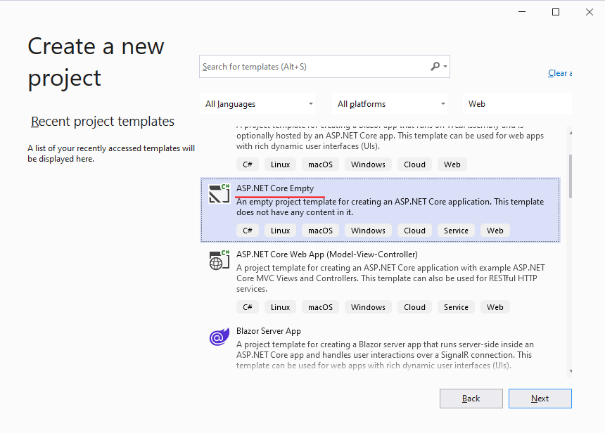

# ASP.NET Core

Вы почти готовы приступить к выполнению основного практического задания! Дело осталось за малым - разобраться, как
разрабатывать web-приложения с  помощью .NET.

ASP.NET Core - это современная и мощная платформа для создания
веб-приложений и веб-сервисов, которая позволяет разработчикам использовать все преимущества платформы .NET и
современных веб-технологий, разработанная компанией Microsoft. Она является пересмотренной и обновленной версией
платформы ASP.NET, которая была первоначально создана для работы в операционных
системах Windows.

Одним из главных преимуществ ASP.NET Core является его кросс-платформенность. Теперь приложения могут быть развернуты на
операционных системах Windows, Linux и macOS. В качестве языков программирования для разработки приложений
на ASP.NET Core используются C# и F#.

## Практика

1. Запрограммируйте два [middleware](https://metanit.com/sharp/aspnet6/2.13.php):
    - при переходе по url `/middleware/hello-world` в ответе должно отображаться `"hello world!"`.
2. Запрограммируйте [Web API](https://metanit.com/sharp/aspnet6/11.1.php) для калькулятора:
    - `GET /calculator/add?x={x}&y={y}`
    - `GET /calculator/sub?x={x}&y={y}`
    - `GET /calculator/mul?x={x}&y={y}`
    - `GET /calculator/div?x={x}&y={y}`

   Используйте `float` в качестве возвращаемого типа данных.
3. Напишите *интеграционные тесты* для API калькулятора с
   помощью [Web Application Factory](https://learn.microsoft.com/ru-ru/aspnet/core/test/integration-tests?view=aspnetcore-7.0)

### Инструкция

- Создайте новую ветку.
- Создайте проект `Dotnet.Intro.Web`.

- Создайте контроллер `CalculatorController` и реализуйте web-методы `Add`, `Sub`, `Mul`, `Did`, используя
  класс `Calculator`, который вы написали в ходе выполнения первой работы.
-

Добавьте [интеграционные тесты](https://learn.microsoft.com/ru-ru/aspnet/core/test/integration-tests?view=aspnetcore-7.0)
в проект `Dotnet.Intro.Tests`.

- Как всегда создайте [MR](https://docs.gitlab.com/ee/user/project/merge_requests/) в ветку `main`.

## Теория

- [Metanit: главы 1 - 5](https://metanit.com/sharp/aspnet6/).
- [Учебник. Создание веб-API с помощью ASP.NET Core](https://learn.microsoft.com/ru-ru/aspnet/core/tutorials/first-web-api?view=aspnetcore-7.0&tabs=visual-studio)
- [Интеграционные тесты на платформе ASP.NET Core](https://learn.microsoft.com/ru-ru/aspnet/core/test/integration-tests?view=aspnetcore-7.0).
- [Документация по ASP.NET](https://learn.microsoft.com/ru-ru/aspnet/core/?view=aspnetcore-7.0).
