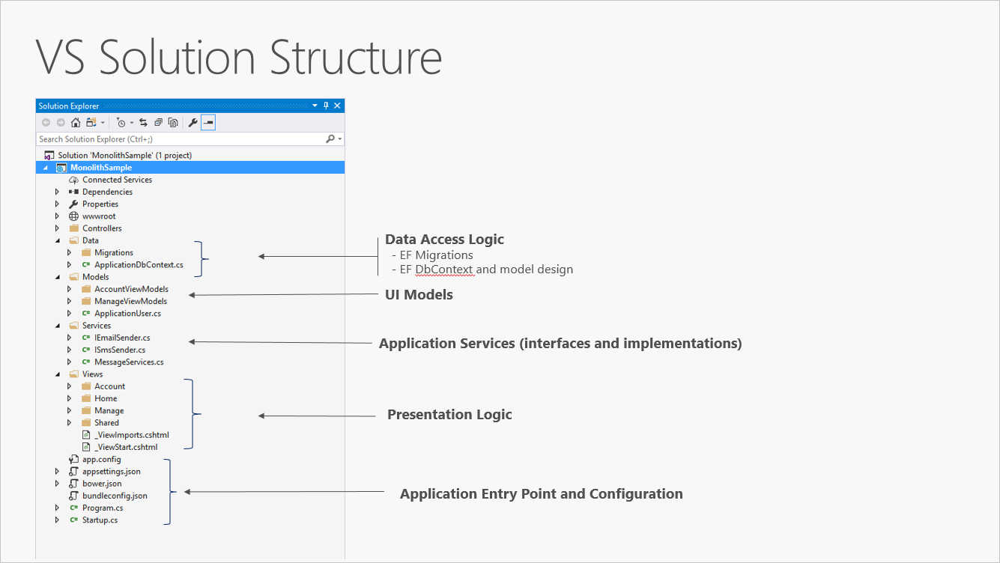

# Бизнес-логика

По мере увеличения сложности и размеров приложения возникает потребность в создании правил огранизации программного кода,
благодаря чему разработчики могут быстро определять, где именно реализованы определенные функции. 
Большинство бизнес-приложений использует преимущества логического разделения на слои.

> Слои обеспечивают логический уровень разделения в приложении. Если логика приложения физически распределена 
> между несколькими серверами или процессами, такие раздельные физические целевые объекты развертывания называются уровнями. 
> Таким образом, не только возможно, но и широко распространено развертывание N-слойных приложений на одном уровне.

Одним из недостатков традиционного многослойного подхода является то, что обработка зависимостей во время 
компиляции осуществляется сверху вниз. Это значит, что слой пользовательского интерфейса зависит от слоя бизнес-логики, который, 
в свою очередь, зависит от слоя доступа к данным.

Приложения, использующие принципы инверсии зависимостей и проблемно-ориентированного проектирования решают проблему зависимости бизнес-логики
от слоя данных с помощью инверсии зависимостей.  На протяжении многих лет она носила самые разные названия. Сначала это была шестигранная архитектура, 
на смену которой пришла архитектура портов и адаптеров. На современном этапе она еще называется многослойной или чистой архитектурой.

## Практика
- Перенесите бизнес-логику из контроллеров в сервисы. Поток управления должен выглядеть так: `Controller → Service → DbContext`
- Создавать репозитории не требуется. Вместо этого внедряйте зависимость `DbContext` [напрямую в сервисы](https://learn.microsoft.com/ru-ru/dotnet/architecture/microservices/microservice-ddd-cqrs-patterns/infrastructure-persistence-layer-implementation-entity-framework-core#using-a-custom-repository-versus-using-ef-dbcontext-directly).

## Теория
- [Общие архитектуры веб-приложений / Комплексные приложения](https://learn.microsoft.com/ru-ru/dotnet/architecture/modern-web-apps-azure/common-web-application-architectures#all-in-one-applications).
- [Внедрение зависимостей и IServiceCollection](https://metanit.com/sharp/aspnet6/4.1.php)
- [Применение пользовательского репозитория по сравнению с непосредственным применением DbContext EF](https://learn.microsoft.com/ru-ru/dotnet/architecture/microservices/microservice-ddd-cqrs-patterns/infrastructure-persistence-layer-implementation-entity-framework-core#using-a-custom-repository-versus-using-ef-dbcontext-directly).
- [Слои, Луковицы, Гексогоны, Порты и Адаптеры — всё это об одном](https://habr.com/ru/post/344164/)