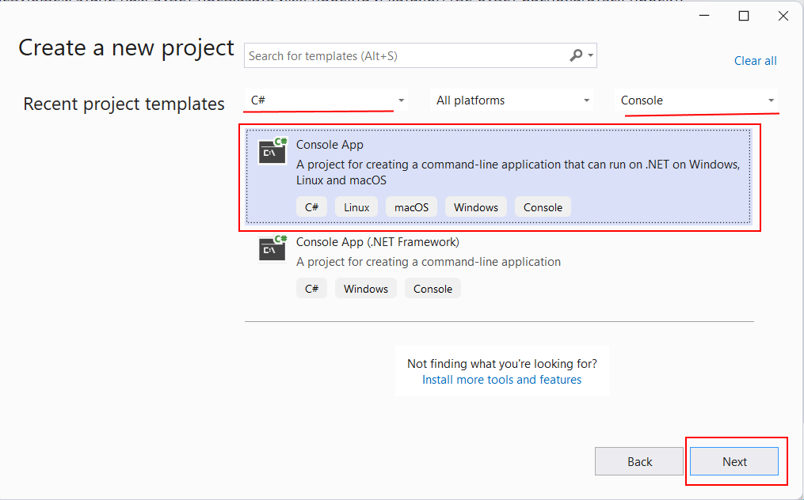
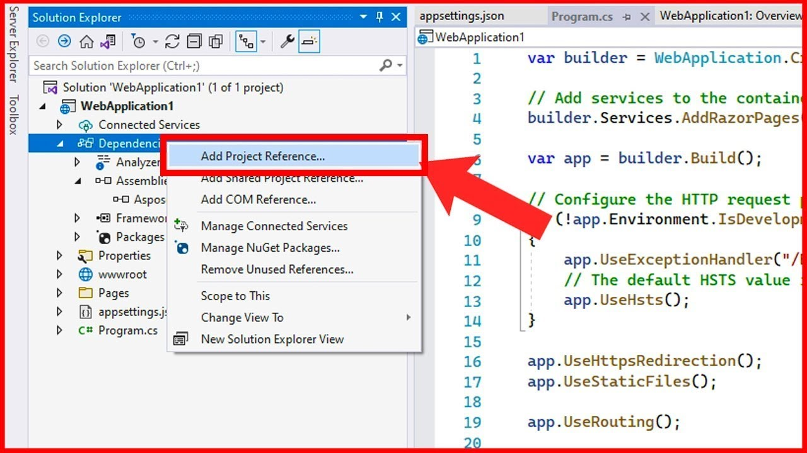

# Разминка

Прежде чем приступить к работе над основным заданием нужно убедиться, что Вы умеете:
- писать простые программы на C#
- [проверять корректность работы программ с помощью автотестов](./testing.md)
- [создавать web-приложения](./asp-net.md)

Давайте сперва разомнёмся и проверим навыки разработки на C#.

## Практика
- Разработайте консольную программу «Калькулятор». Калькулятор должен получать ровно три параметра: первое число, математическая операция, второе число.
- Поддерживаемые операции:
    - сложение +
    - вычитание -
    - умножение *
    - деление /
- программа должна печатать в консоль результат и возвращать код 0 в случае успеха или код -1 в случае ошибки.
- программа не должна выбрасывать необработанные исключения.

### Инструкция
- [Создайте fork репозитория](https://knrtu-kai.gitlab.yandexcloud.net/dotnet/dotnet/-/wikis/%D0%9A%D0%B0%D0%BA-%D1%80%D0%B0%D0%B1%D0%BE%D1%82%D0%B0%D1%82%D1%8C-%D1%81-%D1%80%D0%B5%D0%BF%D0%BE%D0%B7%D0%B8%D1%82%D0%BE%D1%80%D0%B8%D0%B5%D0%BC/%D0%9F%D0%BE%D1%88%D0%B0%D0%B3%D0%BE%D0%B2%D0%B0%D1%8F-%D0%B8%D0%BD%D1%81%D1%82%D1%80%D1%83%D0%BA%D1%86%D0%B8%D1%8F) (пункт 1).
- Создайте новую ветку от ветки main. В ней уже будет заготовка с классом `Calculator`.
- Создайте консольный проект `Dotnet.Console` в солюшене `Dotnet` и запрограммируйте калькулятор, используя класс-заготовку из проекта `Dotnet.Intro`.

- Для того, чтобы использовать класс `Calculator` в проекте `Dotnet.Console` убедитесь, что Вы добавили ссылку на проект `Dotnet.Intro`.

- После выполнения задания создайте [MR](https://docs.gitlab.com/ee/user/project/merge_requests/) в ветку `main`.

## Теория
- [Выберите и настройте IDE](../-/wikis/Как-работать-с-репозиторием/Перед-началом-работы#инструментарий).
