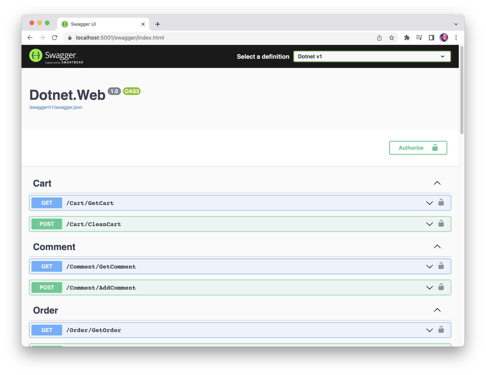

# REST и Swagger
Поздравляем, Вы закончили вводную часть. Время приступить к основному [практическому заданию](https://knrtu-kai.gitlab.yandexcloud.net/dotnet/dotnet/-/wikis/%D0%9F%D1%80%D0%B0%D0%BA%D1%82%D0%B8%D1%87%D0%B5%D1%81%D0%BA%D0%BE%D0%B5-%D0%B7%D0%B0%D0%B4%D0%B0%D0%BD%D0%B8%D0%B5).
Покупателями в нашем магазине будут роботы, поэтому начнём мы с определения программного интерфейса (API) для них.

### API 
API - это механизмы, которые позволяют двум программным компонентам взаимодействовать друг с другом, используя набор определений и протоколов. Например, система ПО метеослужбы содержит ежедневные данные о погоде. Приложение погоды на телефоне «общается» с этой системой через API и показывает ежедневные обновления погоды на телефоне.

### Swagger (OpenAPI)  
[Swagger (OpenAPI)](https://swagger.io/tools/swaggerhub/?utm_source=aw&utm_medium=ppcg&utm_campaign=SEM_SwaggerHub_PR_EMEA_ENG_EXT_Prospecting_Tier2&utm_term=swagger&utm_content=610540077355&gclid=Cj0KCQjw8e-gBhD0ARIsAJiDsaVzJZD3D3kyKj2Km7FkknND_jN_Odw3mdvt1WHAOE43x4GIaKeJd8AaAsVyEALw_wcB&gclsrc=aw.ds) -  это не зависящая от языка спецификация для описания REST API. Она позволяет компьютерам и пользователям лучше понять возможности REST API без прямого доступа к исходному коду. Ее основные цели:
- свести к минимуму объем работ, необходимых для соединения отдельных служб.
- сократить время, необходимое для точного документирования службы.

## Практика
Создайте API, соответствующее файлу `swagger.json` из теста. Сами методы API реализовывать пока не нужно: 
просто напишите в теле каждого метода `throw new NotImplementedException();`. Используйте контроллеры
и библиотеку [Swashbuckle Swagger](https://learn.microsoft.com/ru-ru/aspnet/core/tutorials/getting-started-with-swashbuckle?view=aspnetcore-7.0&tabs=visual-studio). В проекте `Dotnet.Web` уже настроена автоматическая генерация Swagger UI. После выполнения задания
вы должны увидеть по адресу https://localhost:5001/swagger/index.html результат как на картинке ниже.

### Инструкция

- Перейдите в ветку `rest`. В проекте `Dotnet.Web.Tests` уже есть тест, проверяющий правильность выполнения задания.
В проекте с тестами уже лежит `swagger.json`, который в итоге должен получиться у вас.
- Ориентируйтесь по ошибкам, которые показывает тест и файлу `swagger.json` из проекта с тестами
- * Для удобства можете поспользоваться библиотекой [Swagger UI](https://swagger.io/tools/swagger-ui/). С ее помощью вы сможете визуально сравнить какие элементы API Вы уже реализовали, а каких не хватает.
- Убедитесь, что все тесты проходят.
- Как всегда создайте [MR](https://docs.gitlab.com/ee/user/project/merge_requests/) в ветку `main`.

## Теория

- [REST](https://ru.wikipedia.org/wiki/REST)
- [ASP.NET Core с использованием Swagger (OpenAPI)](https://learn.microsoft.com/ru-ru/aspnet/core/tutorials/web-api-help-pages-using-swagger?view=aspnetcore-7.0)
- [OpenAPI Specification and Swagger](https://swagger.io/solutions/getting-started-with-oas/)
- [Руководство по ASP.NET Core: главы 1, 2, 4 ](https://metanit.com/sharp/aspnet6/)
- [Улучшение процесса разработки API с помощью документации по Swagger](https://learn.microsoft.com/ru-ru/training/modules/improve-api-developer-experience-with-swagger/)